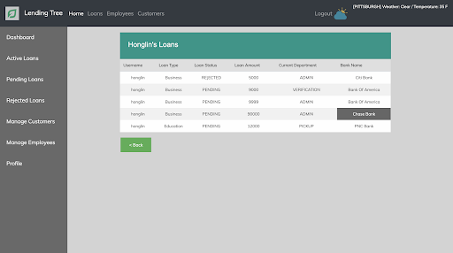

# LendingTree (Back-end)

## Description
- Online Automated Web Based System
- Provide an interface to help customers to apply loans online and keep track of the loan status
- Assist loan agencies to complete the formalities and procedures, e.g. accept or reject the loans from customers, check the pending loans, assign it to departments
- Provide a transparency system for both customers and loan agencies
- Purpose: speed up the whole organizational process

## Project Modules
- **Administrator**: Mange Customers, Employees, Loans and assign loan applications to pickup department to start loan process
- **Pickup**: View all loan requests which assigned by bank administrator and collect documents from customers against his/her applied loans. Applications automatically forward to Verification department once pickup process done by employees at pickup department
- **Verification**: View all loan requests after Pickup, employee will check documents collected by pickup department as per bank rule, and submit verify or reject comment to bank
- **Legal**: Employees can view all loans after Verification, employees will verify legal about terms & conditions of bank. Once Legal submitted, application status will automatically send to customer email and bank admin

## Instruction
1. Install Jetbrain IntelliJ IDEA on your computer
2. Import project into IntelliJ
3. Import/download Maven dependencies
4. Modify application.properties to fit your environment
5. Import loan.sql database to Mysql database
6. Run application
7. Open localhost:8080/ in the browser (Chrome / Firefox)

## Documentation (Swagger)

Open localhost:8080/swagger-ui.html in the browser

## Log Files Directory

After running program, log files will auto generated and store inside the Logs/

## Front-end (Github link)
https://github.com/johnwei417/LendingTree-FE

## Screenshot

